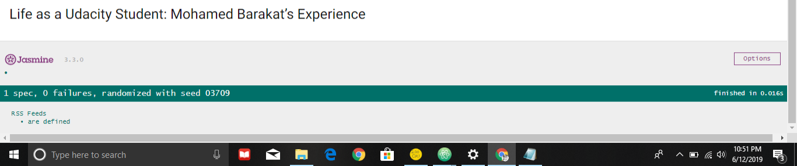
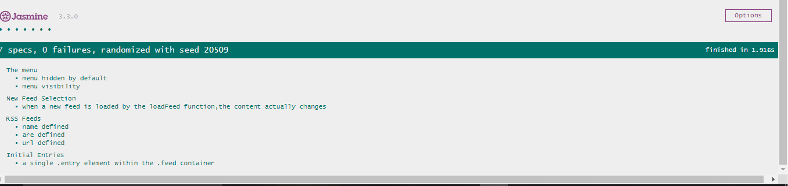

# Freedreader master Project

## Table of Contents

- [Project Overview](#Project-Overview)
- [Why this Project?](#Why-this-Project)
- [What will we learn from this project?](#What-will-we-learn-from-this-project)
- [How will this project help our career?](#How-will-this-project-help-our-career)
- [Link of project which is to be tested](#Link-of-project-which-is-to-be-tested)
- [Steps followed in this project](#Steps-followed-in-this-project)
- [How to run this Project?](#How-to-run-this-Project)
- [Contributing](#Contributing)

--------------------------------------------------------------------------------

## Project Overview

In this project we are given a web-based application that reads RSS feeds. The original developer of this application clearly saw the value in testing, they've already included [Jasmine](http://jasmine.github.io/) and even started writing their first test suite! Unfortunately, they decided to move on to start their own company and we're now left with an application with an incomplete test suite.

--------------------------------------------------------------------------------

## Why this Project?

Testing is an important part of the development process and many organizations practice a standard of development known as "test-driven development." This is when developers write tests first, before they ever start developing their application. All the tests initially fail and then they start writing application code to make these tests pass.

Whether we work in an organization that uses test-driven development or in an organization that uses tests to make sure future feature development doesn't break existing features, it's an important skill to have!

--------------------------------------------------------------------------------

## What will we learn from this project?

We will learn how to use Jasmine to write a number of tests against a pre-existing application. These will test the underlying business logic of the application as well as the event handling and DOM manipulation.

--------------------------------------------------------------------------------

## How will this project help our career?

Writing effective tests requires analyzing multiple aspects of an application including the HTML, CSS and JavaScript - an extremely important skill when changing teams or joining a new company.

Good tests give you the ability to quickly analyze whether new code breaks an existing feature within your codebase, without having to manually test all of the functionality.

--------------------------------------------------------------------------------

## Link of project which is to be tested

```
  <https://github.com/udacity/frontend-nanodegree-feedreader.git>
```

--------------------------------------------------------------------------------

## Steps followed in this project

1. First, I have familiarized myself with the starter code.

2. Then, opened `index.html` and reviewed the functionality of the application in a browser.

_View of "jasmine_html-reporter" before writing the tests_



1. Then, I have read all code comments in "app.js" and checked out `style.css` to know how is styling applied to the application.

2. Next, explored the Jasmine spec file in `feedreader.js` in which all the tests will be written.

3. Edited the `allFeeds` variable in `app.js` to make the provided test fail. I have saw how Jasmine visualizes this failure in this application. Returned the `allFeeds` variable to a passing state after reviewing the failed test.

4. Four test suites are written:

  - RSS Feeds
  - The menu
  - Initial Entries
  - New Feed Selection

5. In first test suite, that is, `RSS Feeds`, two specs are written: _Already, they have given a spec named "are defined"._

  - **are defined**: It tests to make sure that the `allFeeds` variable has been defined and that it is not empty.

  - **url defined**: It is a test that loops through each feed in the `allFeeds` object and ensures it has a URL defined and that the URL is not empty.

  - **name defined**: It is our third test that loops through each feed in the `allFeeds` object and ensures it has a name defined and that the name is not empty.

6. In second test suite, that is, `The menu`, two specs are written:

  - **menu hidden by default**: It is the first test of menu that ensures the menu element is hidden by default.

  - **menu visibility**: It is the second test of menu that ensures the menu changes visibility when the menu icon is clicked. This test requires two expectations-does the menu display when clicked and does it hide when clicked again.

7. In third test suite, that is, `Initial Entries`, one spec is written:

- **a single .entry element within the .feed container**: It is a test that ensures when the loadFeed function is called and completes its work, there is at least a single .entry element within the .feed container.

1. In fourth test suite, that is, `New Feed Selection`, one spec is written:

  - **when a new feed is loaded by the loadFeed function, the content actually changes**: It is a test that ensures when a new feed is loaded by the loadFeed function, the content actually changes.

2. After writing all the tests, I have reloaded the **index.html** file and ensured that there are no failures. _View of "jasmine_html-reporter" division after passing all the tests_

  

3. I have ensured the following also:

  - No test should be dependent on the results of another.
  - Callbacks should be used to ensure that feeds are loaded before they are tested.
  - Error handling is implemented for undefined variables and out-of-bound array access.

--------------------------------------------------------------------------------

## How to run this Project?

First, unzip the downloaded project folder of the application which is going to be tested. Then, open the `index.html` file in a browser to observe and analyze the project. First, we will get 1 spec,0 failures as they have already written a test suite with ona spec. Then we should write tests for each test suite which are specified in feedreader.js. Then, observe the output by reloading the index.html whether the tests are passed or not. After all the tests are passed, then the project is said to be tested successfully using **jasmine framework**.

--------------------------------------------------------------------------------

## Contributing

This project folder consist of a file named "feedreader.js", which consist of different test suites with different specs, along with other required files and folders. This project is for the one who wants to take a look and know how tests are performed in an application using **Jasmine Framework**.
